# Evidencias del Sistema de Gestión de Pacientes

Esta carpeta contiene las **18 capturas reales de ejecución** utilizadas como evidencia visual del proyecto. Todas las imágenes están guardadas directamente en el repositorio en formato PNG.

## 1. Menú principal

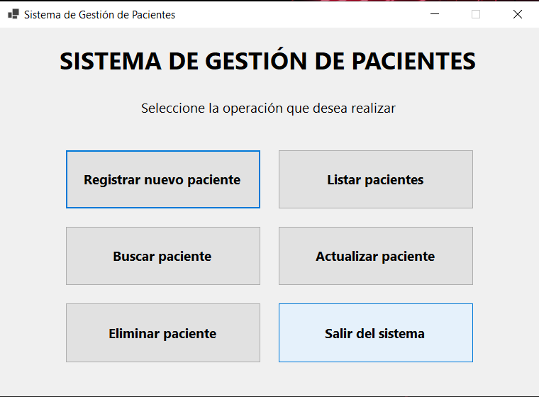

## 2. Formulario para registrar paciente

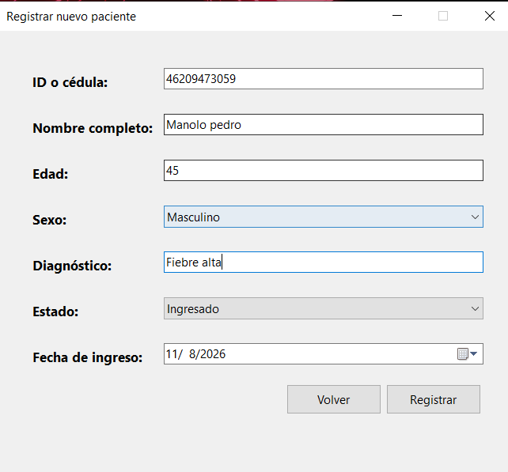

## 3. Registro exitoso

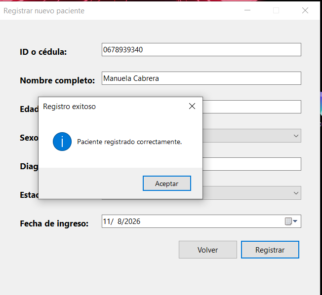

## 4. Validación de campo obligatorio

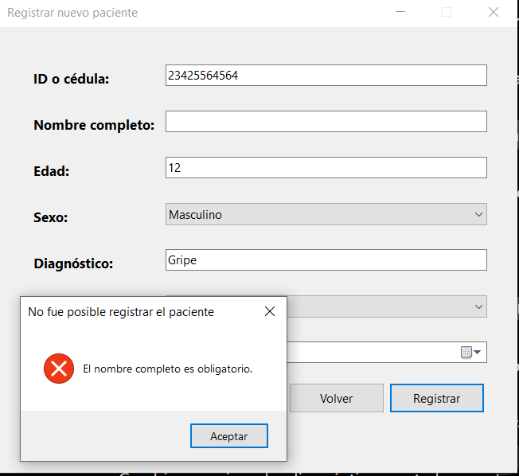

## 5. Validación de edad incorrecta

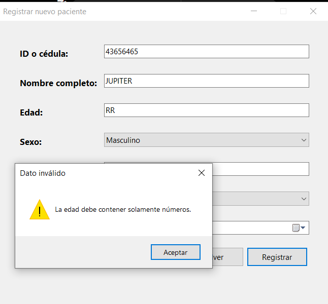

## 6. Validación de ID duplicado

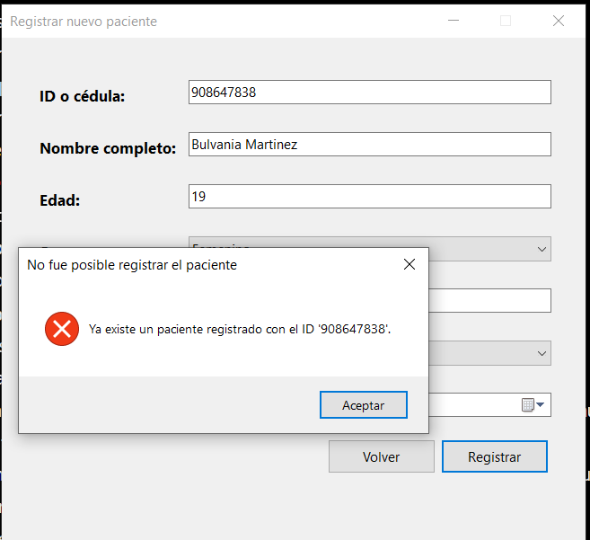

## 7. Listado de pacientes

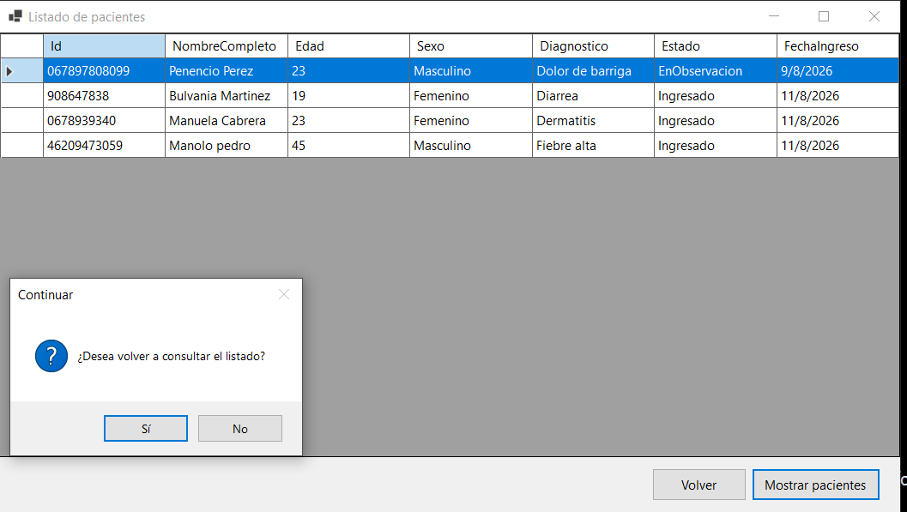

## 8. Búsqueda de paciente por ID

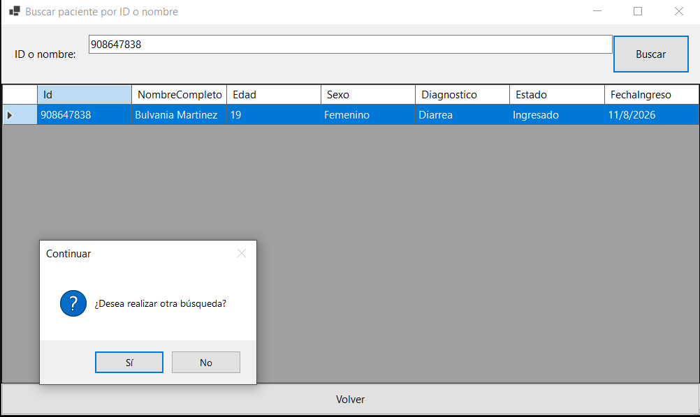

## 9. Búsqueda por nombre

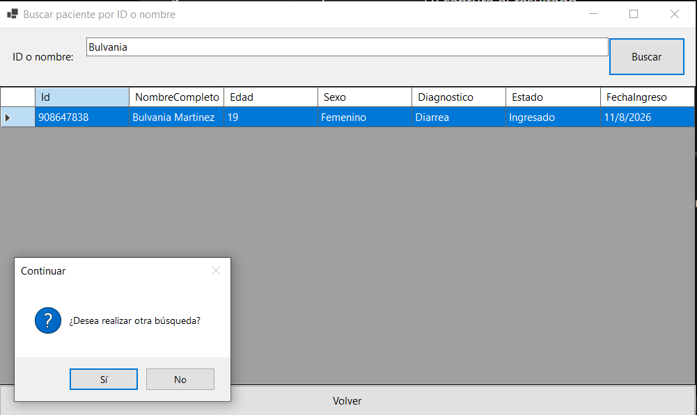

## 10. Paciente o ID inexistente

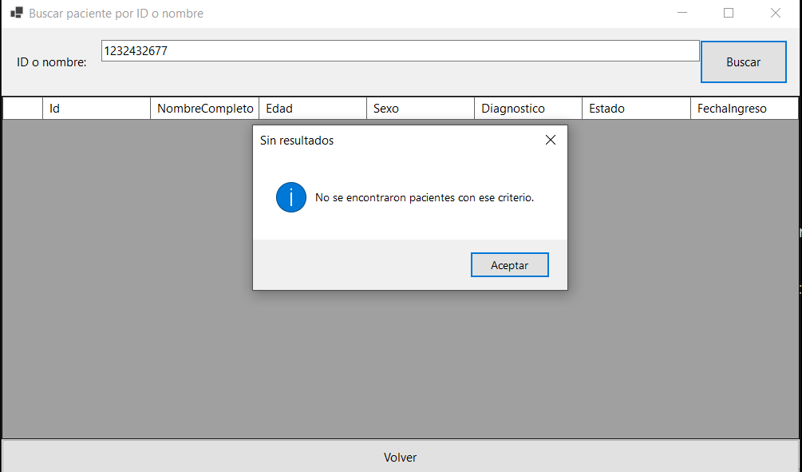

## 11. Pregunta para repetir el registro

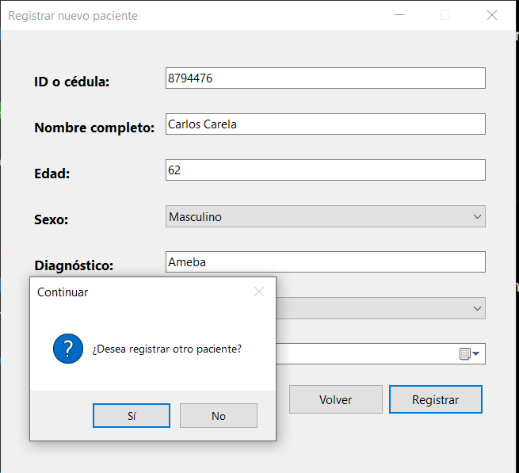

## 12. Formulario para actualizar paciente

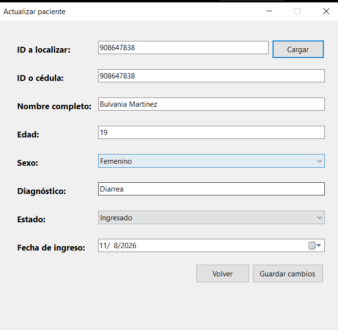

## 13. Actualización exitosa

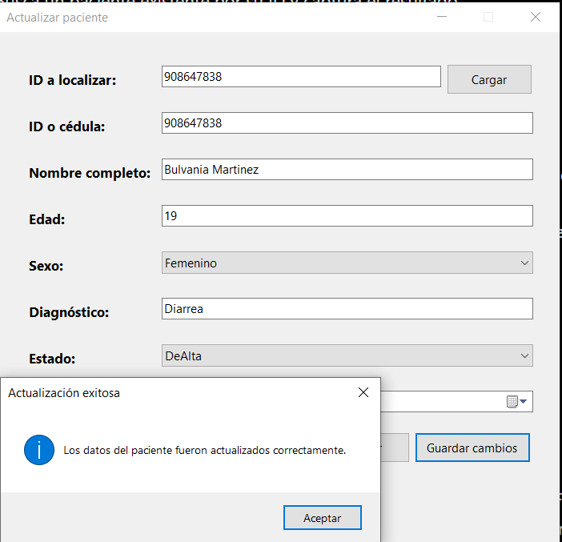

## 14. Formulario para eliminar paciente

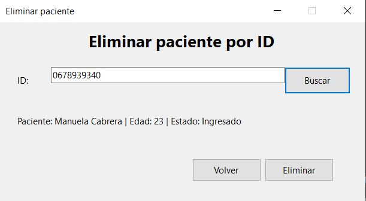

## 15. Confirmación antes de eliminar

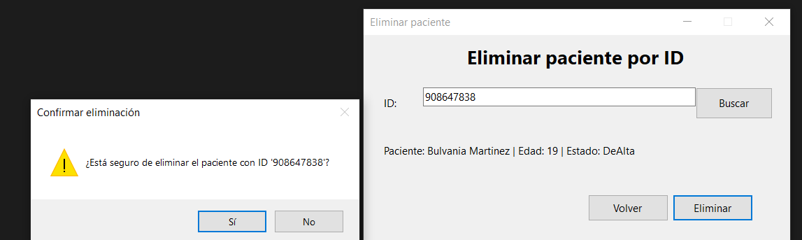

## 16. Eliminación exitosa

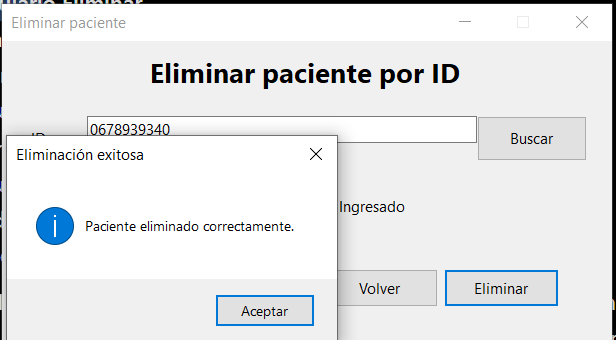

## 17. Listado después de eliminar

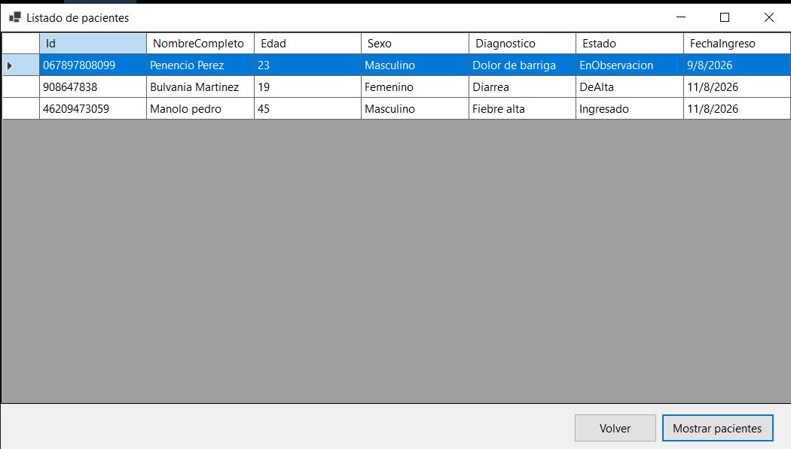

## 18. Pregunta para repetir actualización o eliminación

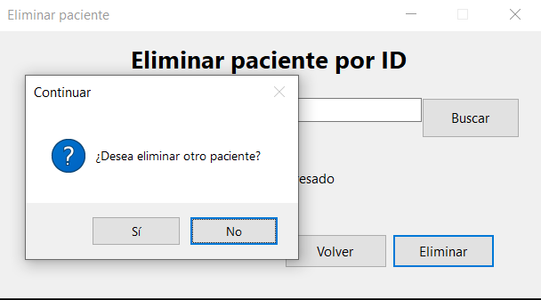
